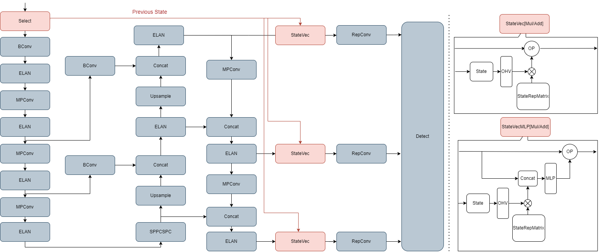

## State Aware Configuration Detection for Augmented Reality Step-by-Step Tutorials

This repository contains resources related to the [paper](https://immersive-technology-lab.github.io/projects/stateawareconfigdetection/assets/ismar23_stanescu.pdf).

<p float="left">
  
</p>

### Datasets

- Flower Capture
- Flower Capture Extended
- Flower Synthetic
- Origami
- Engine [TBA]

Datasets download link [here](https://files.icg.tugraz.at/d/1b4721097aa3422db051/).

### Network

Our approach is based on Yolov7 [1] which we extended, by adding the StateVec module for introducing the state graph context into the network:




### References:
1. Wang, Chien-Yao, Alexey Bochkovskiy, and Hong-Yuan Mark Liao. "YOLOv7: Trainable bag-of-freebies sets new state-of-the-art for real-time object detectors." In Proceedings of the IEEE/CVF Conference on Computer Vision and Pattern Recognition, pp. 7464-7475. 2023.


### Cite
```bibtex
@InProceedings{stanescu23stateaware,
title={State-Aware Configuration Detection for Stap-by-Step Augmented Reality Tutorials},
author={Stanescu, Ana and Mohr, Peter and Kozinski, Mateusz and Mori, Shohei and Schmalstieg, Dieter and Kalkofen, Denis},
booktitle={2023 IEEE International Symposium on Mixed and Augmented Reality (ISMAR)}, 
title={State-Aware Configuration Detection for Augmented Reality Step-by-Step Tutorials}, 
year={2023}}
}
```
